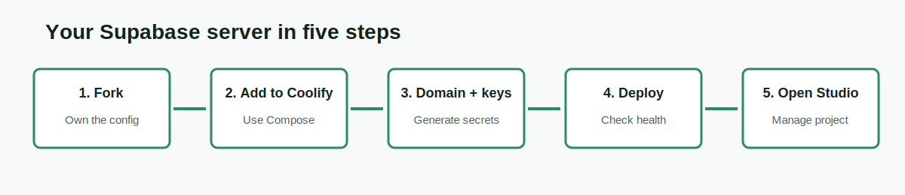

# Supabase Turkiye Community

**A community-maintained distribution and documentation project for running Supabase on your own infrastructure.**

[English setup guide](./docs/ENGLISH-SETUP.md) | [Turkish README](./README.md) | [Report an issue](https://github.com/akin-umit/supabase-turkiye-community/issues/new/choose) | [Discussions](https://github.com/akin-umit/supabase-turkiye-community/discussions)

> [!IMPORTANT]
> This project is not operated, supported, sponsored, or officially endorsed by Supabase. It is an independent Turkiye community initiative that uses Supabase open-source components. The upstream project is [supabase/supabase](https://github.com/supabase/supabase).

## Why This Project Exists

Supabase provides an official open-source Docker Compose deployment. Community platforms such as Coolify can make that deployment easier to start, but new operators still need clear answers for domains, secrets, API keys, service health, backups, upgrades, migrations, and common container failures.

This project turns those operational lessons into a reusable, Git-managed distribution with Turkish-first beginner documentation and English technical guidance. It also creates a controlled path for sending generic improvements back to the appropriate upstream Supabase repositories.

## What You Can Do

- Deploy Supabase through Coolify or plain Docker on a Linux server.
- Generate secure dashboard credentials, API keys, and asymmetric JWT keys.
- Configure Auth, REST, Realtime, Storage, Edge Functions, Kong, Studio, PostgreSQL, and Supavisor.
- Use a single HTTPS domain while keeping internal services off the public network.
- Follow documented backup, restore, upgrade, rollback, and migration procedures.
- Diagnose common Coolify and Docker failures.
- Contribute documentation, deployment improvements, tests, and upstream-ready fixes.

## Choose Your Path

| Your situation | Start here |
|---|---|
| I use Coolify and want guided setup | [English setup guide](./docs/ENGLISH-SETUP.md#path-a-coolify) |
| I manage a Linux VPS and Docker | [Docker/VPS deployment](./DEPLOYMENT.md#duz-docker--vps) |
| I am migrating from Supabase Cloud | [Migration guide](./MIGRATION.md) |
| My stack is already running | [Operations guide](./OPERATIONS.md) |
| I need capability and Cloud parity details | [Platform capabilities](./PLATFORM-CAPABILITIES.en.md) |
| I see a 503 or gateway error | [Troubleshooting](./docs/TROUBLESHOOTING.en.md) |
| I want to contribute | [Contribution guide](./CONTRIBUTING.md) |

## Important: One Stack Is One Project

A self-hosted Supabase Compose deployment represents one isolated Supabase project. Self-hosted Studio does not provide the Supabase Cloud control plane for creating and managing multiple organizations and projects from one dashboard.

To run a second isolated project, deploy a second stack with its own database, persistent storage, domain, secrets, and backup lifecycle.

## Public Routes

If your domain is `https://supabase.example.com`:

| Capability | Route |
|---|---|
| Studio | `https://supabase.example.com/project/default` |
| Auth API | `https://supabase.example.com/auth/v1` |
| REST API | `https://supabase.example.com/rest/v1` |
| Storage API | `https://supabase.example.com/storage/v1` |
| Edge Functions | `https://supabase.example.com/functions/v1` |

Public application traffic is routed through Kong. Host-published Kong and Supavisor ports must also be restricted with firewall rules or loopback bindings; a reverse proxy does not close them automatically. Database, Auth, REST, Realtime, Storage, Functions, Meta, and Studio must not receive direct access from untrusted networks.

## Cloud and Self-Hosted Are Not Identical

This repository does not claim to reproduce every Supabase Cloud or Pro feature. Supabase Cloud operates the control plane and managed services around projects. In self-hosting, you are responsible for:

- Server and operating-system maintenance
- Security hardening and secret management
- Database maintenance and capacity planning
- Monitoring, availability, and scaling
- Backups, restore testing, and disaster recovery
- Upgrades and compatibility validation

Self-hosting provides infrastructure control and data ownership, but it transfers operational responsibility to you. See [Platform capabilities and evidence](./PLATFORM-CAPABILITIES.en.md) before choosing it for production.

## Security Rules

> [!CAUTION]
> Never deploy the placeholder credentials from `.env.example`. Never commit a real `.env` file. Never expose `SUPABASE_SECRET_KEY`, service-role credentials, `POSTGRES_PASSWORD`, or private JWT keys in browser or mobile code.

Generate fresh keys, use HTTPS, expose only the intended gateway, restrict database access, and maintain off-server backups. A successful deployment is not complete until restore and smoke checks are documented.

## Included Services

- **Studio** for project administration
- **Kong** as the API gateway
- **PostgreSQL** as the database
- **Auth** for users, sessions, and JWT authentication
- **PostgREST** for the REST API
- **Realtime** for database change broadcasts
- **Storage** and **imgproxy** for files and image processing
- **Edge Runtime** for Edge Functions
- **postgres-meta** for database metadata operations
- **Supavisor** for PostgreSQL connection pooling
- Optional logging, analytics, S3-compatible storage, and reverse-proxy overlays

## Documentation

- [English beginner setup](./docs/ENGLISH-SETUP.md)
- [Turkish illustrated setup](./docs/TURKCE-KURULUM.md)
- [Deployment](./DEPLOYMENT.md)
- [Coolify](./COOLIFY.md)
- [Edge Functions secret management](./FUNCTION-SECRETS.en.md)
- [Dashboard and control-plane roadmap](./DASHBOARD-ROADMAP.en.md)
- [Read-only operational Management API](./MANAGEMENT-API.en.md)
- [Isolated backup restore drill](./RESTORE-DRILL.en.md)
- [Configuration reference](./CONFIG.md)
- [Operations, backup, restore, and rollback](./OPERATIONS.md)
- [Migration](./MIGRATION.md)
- [Platform capabilities and evidence](./PLATFORM-CAPABILITIES.en.md)
- [AI/operator handoff](./AI-HANDOFF.md)
- [Private-test to community publication flow](./COMMUNITY-PUBLICATION-FLOW.md)
- [GitHub Discussions and bilingual publication plan](./DISCUSSIONS.md)
- [Version history](./versions.md)
- [Documentation maintenance contract](./DOCUMENTATION-MAINTENANCE.md)
- [Official Supabase README - Turkish explained translation](./docs/SUPABASE-RESMI-README-TR.md)
- [Official Supabase README - English original](https://github.com/supabase/supabase/blob/master/README.md)
- [Upstream documentation sync policy](./docs/UPSTREAM-DOC-SYNC.md)
- [Supabase fork sync policy](./UPSTREAM-FORK-SYNC.md)

## Contribution and Upstream Flow

1. Start with a reproducible Issue or Discussion.
2. Open a focused community pull request without private deployment data.
3. Pass Compose, shell, documentation, and secret checks.
4. Classify the change as `community-only`, `deployment-only`, or `upstream-candidate`.
5. Reproduce upstream candidates against the current relevant Supabase repository.
6. Prepare a minimal branch in our [Supabase fork](https://github.com/akin-umit/supabase).
7. Submit upstream only after following the target repository's contribution rules.

## Community Discussions

- [Gelistirme Gunlugu / Development Log](https://github.com/akin-umit/supabase-turkiye-community/discussions/18)
- [Yol Haritasi ve Katki Plani / Roadmap and Contribution Plan](https://github.com/akin-umit/supabase-turkiye-community/discussions/19)
- [Discussion plan and templates](./DISCUSSIONS.md)

See [GOVERNANCE.md](./GOVERNANCE.md) and [UPSTREAM-CONTRIBUTIONS.md](./UPSTREAM-CONTRIBUTIONS.md).

## License, Attribution, and Trademark

Repository content is distributed under the Apache License 2.0. Runtime components can have their own licenses. The Supabase name is used to identify the upstream project and compatibility target; it does not imply endorsement or official status.

[LICENSE](./LICENSE) | [NOTICE.md](./NOTICE.md) | [BRANDING.md](./BRANDING.md) | [THIRD_PARTY_LICENSES.md](./THIRD_PARTY_LICENSES.md)
