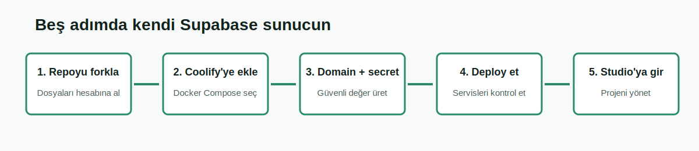

# Supabase Türkiye Community

**Supabase'i kendi sunucunda kurmak ve Türkçe kaynaklarla yönetmek için topluluk projesi.**

[Türkçe kuruluma başla](./docs/TURKCE-KURULUM.md) · [English README](./README.en.md) · [Sorun bildir](https://github.com/akin-umit/supabase-turkiye-community/issues/new/choose) · [Soru sor](https://github.com/akin-umit/supabase-turkiye-community/discussions)

> [!IMPORTANT]
> Bu proje Supabase tarafından işletilmez, desteklenmez, sponsor edilmez veya resmî olarak onaylanmaz. Supabase açık kaynak bileşenlerini kullanan bağımsız bir Türkiye topluluğu çalışmasıdır. Kaynak proje: [supabase/supabase](https://github.com/supabase/supabase).

## Dil Onceligi

Bu repository Turkce-first ilerler. Kurulum, hata cozumu, guvenlik, backup,
migration, dashboard sinirlari ve operator notlari once Turkce ana belgelere
yazilir. Ingilizce belgeler uluslararasi katilim ve upstream iletisim icin
destekleyici aynalardir; Turkce kullaniciyi eksik bilgiyle birakmamalidir.

## Burada Ne Yapabilirsin?

- Supabase'i Coolify veya düz Docker ile kendi sunucuna kurabilirsin.
- Türkçe adımlarla kullanıcı adı, parola, domain ve API anahtarlarını hazırlayabilirsin.
- Kurulum hatalarını Türkçe hata rehberiyle çözebilirsin.
- Geliştirmeleri Pull Request ile topluluğa, uygun olanları resmî Supabase projesine gönderebilirsin.

## İlk Defa Kuruyorsan

Teknik terimleri bilmiyorsan doğrudan şu rehberi aç:

### [Türkçe Resimli Kurulum Rehberini Aç](./docs/TURKCE-KURULUM.md)

Rehber sana sırayla şunları yaptırır:

1. Sunucunun yeterli olup olmadığını kontrol etme.
2. GitHub reposunu kendi hesabına alma.
3. Coolify'de doğru kaynak türünü seçme.
4. Domain ve ortam değişkenlerini doldurma.
5. Güvenli şifre ve API anahtarlarını üretme.
6. Kurulumu başlatma ve çalışan servisleri kontrol etme.
7. Studio'ya giriş yapma ve uygulama anahtarlarını bulma.

## Hangi Kurulum Sana Uygun?

| Durumun | Seçmen gereken yol |
|---|---|
| Coolify panelim var, komut satırı bilmiyorum | [Coolify ile resimli kurulum](./docs/TURKCE-KURULUM.md#yol-a-coolify-ile-kurulum) |
| Linux sunucum var, terminal kullanabiliyorum | [Docker/VPS kurulumu](./DEPLOYMENT.md#duz-docker--vps) |
| Supabase Cloud projemi taşıyacağım | [Taşıma rehberi](./MIGRATION.md) |
| Kurulum çalışıyor, bakım/yedek alacağım | [Operasyon rehberi](./OPERATIONS.md) |
| Bir hata aldım | [Türkçe hata kontrol listesi](./docs/TURKCE-KURULUM.md#sik-hatalar) |
| Katkı yapmak istiyorum | [Katkı rehberi](./CONTRIBUTING.md) |

503, gateway timeout veya Coolify route hatasi gorursen once [Sorun giderme](./docs/TROUBLESHOOTING.md) sayfasini oku. Bu sayfa hangi hata kodunun ne anlama geldigini ve Gate 3/Gate 4 test siralamasini ayirir.

## Önemli Gerçek: Tek Kurulum Tek Projedir

Self-hosted Supabase Studio, Supabase Cloud'daki gibi aynı panelden sınırsız yeni proje oluşturmaz. Bu Docker yapısında **bir stack bir Supabase projesidir**. İkinci bağımsız proje için ikinci stack, ayrı veritabanı, ayrı domain ve ayrı secret seti gerekir.

Supabase Cloud ile self-hosted sürüm arasındaki farkları [Platform Yetenekleri](./PLATFORM-CAPABILITIES.md) belgesinde Türkçe görebilirsin.

## Kurulumdan Sonra Hangi Adresler Çalışır?

Domainin `https://supabase.ornek.com` ise:

| İşlem | Adres |
|---|---|
| Studio yönetim paneli | `https://supabase.ornek.com/project/default` |
| Auth API | `https://supabase.ornek.com/auth/v1` |
| REST API | `https://supabase.ornek.com/rest/v1` |
| Storage API | `https://supabase.ornek.com/storage/v1` |
| Edge Functions | `https://supabase.ornek.com/functions/v1` |

Public uygulama trafiği Kong üzerinden yönlendirilir. Compose'un hosta yayınladığı Kong ve Supavisor portları ayrıca firewall veya loopback bind ile sınırlandırılmalıdır; reverse proxy bu portları kendiliğinden kapatmaz. PostgreSQL, Auth, Storage, Realtime ve diğer iç servislere güvenilmeyen ağlardan doğrudan erişim verilmez.

## Güvenlik Uyarısı

> [!CAUTION]
> `.env.example` içindeki örnek şifrelerle production kurulumu başlatma. `.env` dosyasını GitHub'a gönderme. `SUPABASE_SECRET_KEY`, `POSTGRES_PASSWORD` ve dashboard parolasını tarayıcı/frontend koduna koyma.

Kurulumdan önce anahtar üretme scriptlerini çalıştır ve sunucu dışına otomatik yedek hedefi hazırla. Ayrıntılar: [Türkçe Kurulum](./docs/TURKCE-KURULUM.md) ve [Operasyon](./OPERATIONS.md).

## Projenin İçindeki Servisler

Bu dağıtım; Supabase Studio, PostgreSQL, Auth, PostgREST, Realtime, Storage, Edge Runtime, Kong, imgproxy, postgres-meta ve Supavisor bileşenlerini içerir. Bileşenlerin ne yaptığını [Platform Yetenekleri](./PLATFORM-CAPABILITIES.md) belgesinden okuyabilirsin.

## Geliştiriciler Nasıl Katkı Verir?

1. Önce Issue veya Discussion açılır.
2. Değişiklik ayrı bir dalda hazırlanır.
3. Pull Request açılır; yapılan işlem ve test sonucu yazılır.
4. CI, Compose yapısını, shell dosyalarını ve özel bilgi sızıntısını denetler.
5. Katkı `community-only`, `deployment-only` veya `upstream-candidate` olarak sınıflandırılır.
6. Supabase'e uygun değişiklik, temiz bir dal ile [Supabase forkumuza](https://github.com/akin-umit/supabase) ve oradan resmî projeye taşınır.

Yönetim kuralları: [GOVERNANCE.md](./GOVERNANCE.md) · [UPSTREAM-CONTRIBUTIONS.md](./UPSTREAM-CONTRIBUTIONS.md)

## Toplulukta Bizi Bul

Proje duyuruları, herkese açık geri bildirimler ve topluluk tartışmaları için:

- [Gelistirme Gunlugu / Development Log](https://github.com/akin-umit/supabase-turkiye-community/discussions/18)
- [Yol Haritasi ve Katki Plani / Roadmap and Contribution Plan](https://github.com/akin-umit/supabase-turkiye-community/discussions/19)
- [Supabase Community — GitHub Discussions](https://github.com/orgs/supabase/discussions/47844)
- [R10 tanıtım konusu](https://www.r10.net/proje-gelistirme-beyin-firtinasi-ortak-ariyorum/4824196-supabase-turkiye-community-turkce-self-hosted-coolify-ve-docker-kaynak-projesi.html)
- [Technopat Sosyal tanıtım konusu](https://www.technopat.net/sosyal/konu/supabase-turkiye-community-turkce-self-hosted-coolify-ve-docker-kaynak-projesi.4140557/)

Bağlantıların sınıflandırması, canonical kaynak kuralı ve yeni topluluk kanalları için [Topluluk ve Proje Tanıtımları](./COMMUNITY.md) dizinine bakabilirsin. Bu paylaşımlar bağımsız topluluk duyurularıdır; resmî Supabase onayı veya ortaklığı anlamına gelmez.

## Sık Sorulan Sorular ve Kaynak Keşfi

Supabase Türkçe kurulum, Coolify, self-hosting, Cloud taşıma, yedekleme ve güvenlik hakkında kısa yanıtlar için [Türkçe Sık Sorulan Sorular](./docs/FAQ.md) sayfasını kullanabilirsin.

Arama, yapay zekâ ve dokümantasyon araçları için proje kaynak haritası [llms.txt](./llms.txt) dosyasında; akademik ve teknik atıf bilgileri [CITATION.cff](./CITATION.cff) dosyasında bulunur. Bu dosyalar herhangi bir arama motorunun veya yapay zekâ sisteminin projeyi indekslemesini ya da kaynak göstermesini garanti etmez.

## Ayrıntılı Belgeler

- [Türkçe resimli başlangıç](./docs/TURKCE-KURULUM.md)
- [Kurulum seçenekleri](./DEPLOYMENT.md)
- [Coolify ayarları](./COOLIFY.md)
- [Sorun giderme](./docs/TROUBLESHOOTING.md)
- [Edge Functions secret yonetimi](./FUNCTION-SECRETS.md)
- [Dashboard ve control-plane yol haritasi](./DASHBOARD-ROADMAP.md)
- [Salt okunur operasyon Management API](./MANAGEMENT-API.md)
- [Izole backup restore tatbikati](./RESTORE-DRILL.md)
- [Ortam değişkenleri](./CONFIG.md)
- [Yedek, güncelleme ve geri dönüş](./OPERATIONS.md)
- [Supabase Cloud'dan taşıma](./MIGRATION.md)
- [Yeni yönetici veya yapay zekâya devir](./AI-HANDOFF.md)
- [Private testten community yayınına akış](./COMMUNITY-PUBLICATION-FLOW.md)
- [GitHub Discussions ve iki dilli yayın planı](./DISCUSSIONS.md)
- [Sürüm geçmişi](./versions.md)
- [Platform yetenekleri ve gerçek durum](./PLATFORM-CAPABILITIES.md)
- [Belge güncelleme sözleşmesi](./DOCUMENTATION-MAINTENANCE.md)
- [Resmî Supabase README - Türkçe açıklamalı çeviri](./docs/SUPABASE-RESMI-README-TR.md)
- [Resmî Supabase README - İngilizce orijinal](https://github.com/supabase/supabase/blob/master/README.md)
- [Upstream belge güncelleme sistemi](./docs/UPSTREAM-DOC-SYNC.md)
- [Supabase fork güncelleme ve upstream sync kuralı](./UPSTREAM-FORK-SYNC.md)

## English

Supabase Türkiye Community is an independent community initiative providing Turkish-first documentation, reproducible self-hosting improvements, and responsible upstream contributions. Read the complete [English README](./README.en.md), follow the [English setup guide](./docs/ENGLISH-SETUP.md), or start contributing through [CONTRIBUTING.md](./CONTRIBUTING.md).

## Lisans ve Marka

Bu repo Apache License 2.0 altında yayımlanır. Çalışan bileşenlerin kendi lisansları olabilir. “Supabase” adı kaynak projeyi ve uyumluluk hedefini belirtmek için kullanılır; resmî temsil veya onay iddiası değildir.

[LICENSE](./LICENSE) · [NOTICE.md](./NOTICE.md) · [BRANDING.md](./BRANDING.md) · [THIRD_PARTY_LICENSES.md](./THIRD_PARTY_LICENSES.md)
