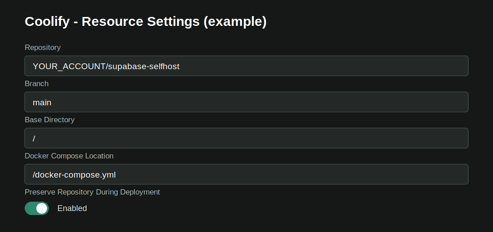

# English Beginner Setup Guide

This guide explains the minimum safe path for people who are new to Supabase self-hosting. Read the complete guide once before deploying.

## Before You Begin

Prepare:

- A Linux server with at least 2 CPU, 4 GB RAM, and 40 GB SSD; 4 CPU, 8 GB RAM, and 80 GB SSD are recommended.
- A domain such as `supabase.example.com` pointing to the server.
- A GitHub account.
- Either Coolify or Docker Engine with Docker Compose v2.

Supabase Cloud and self-hosting are different products. One self-hosted stack represents one project, and you operate its server, security, backups, and updates.

## Path A: Coolify

### 1. Fork the Repository

Use GitHub's **Fork** button and create a copy in your account. Do not add a real `.env` file or credentials to that fork.

### 2. Create the Resource

In Coolify, create a Docker Compose resource from your GitHub repository:

| Field | Value |
|---|---|
| Branch | `main` |
| Base Directory | `/` |
| Docker Compose Location | `/docker-compose.yml` |
| Preserve Repository During Deployment | Enabled |



### 3. Configure the Domain

Assign only this public domain to the `kong` service:

```text
https://supabase.example.com
```

Do not add `:8000` when Coolify terminates HTTPS. Do not generate separate public domains for Studio, Auth, REST, Realtime, Storage, Functions, Meta, or Supavisor.

### 4. Generate Secrets

Use a temporary Linux checkout to generate a real `.env`:

```bash
git clone https://github.com/YOUR_ACCOUNT/YOUR_FORK.git supabase-selfhost
cd supabase-selfhost
cp .env.example .env
sh utils/generate-keys.sh --update-env
sh utils/add-new-auth-keys.sh --update-env
```

The second script also enables the modern JWKS settings in `docker-compose.yml`. If Coolify deploys your fork, review and commit/push the changed `docker-compose.yml` to a separate branch in that fork; otherwise Coolify continues to use the old Compose configuration. Never commit `.env`.

Set your URLs:

```env
SUPABASE_PUBLIC_URL=https://supabase.example.com
API_EXTERNAL_URL=https://supabase.example.com/auth/v1
SITE_URL=https://app.example.com
STUDIO_DEFAULT_ORGANIZATION=Example Organization
STUDIO_DEFAULT_PROJECT=Example Supabase Project
```

Import the resulting environment values into Coolify's Environment Variables area. Never commit the generated `.env`.

`DASHBOARD_USERNAME` and `DASHBOARD_PASSWORD` protect Studio with HTTP Basic Authentication. The password must include at least one letter.

### 5. Deploy and Verify

Save, reload the Compose file, and deploy. A finished deployment is not enough: services must remain `running` or `healthy`. A service that repeatedly enters `restarting` state indicates a failed deployment.

Open:

```text
https://supabase.example.com/project/default
```

Sign in with `DASHBOARD_USERNAME` and `DASHBOARD_PASSWORD`.

## Path B: Plain Docker on Linux

```bash
git clone https://github.com/akin-umit/supabase-turkiye-community.git supabase-selfhost
cd supabase-selfhost
cp .env.example .env
sh utils/generate-keys.sh --update-env
sh utils/add-new-auth-keys.sh --update-env
```

Update the URL values in `.env`, then run:

```bash
docker compose --env-file .env config -q
docker compose pull
docker compose up -d
docker compose ps
```

For production, place Kong behind an HTTPS reverse proxy such as Caddy, Nginx, or Traefik. A reverse proxy does not close host-published ports such as `8000`, `8443`, `15432`, or `6543`. Block direct access with firewall rules or loopback bindings, expose only the intended HTTPS entry point, and never expose PostgreSQL or Supavisor to untrusted networks.

## Application Credentials

| Variable | Purpose |
|---|---|
| `SUPABASE_PUBLIC_URL` | Supabase client URL |
| `SUPABASE_PUBLISHABLE_KEY` or `ANON_KEY` | Browser/mobile client key |
| `SUPABASE_SECRET_KEY` | Trusted server-side code only |
| `POSTGRES_PASSWORD` | Database administration |

Never place secret, service-role, database, or private JWT credentials in frontend code.

## Edge Functions Secrets

Do not write function secret values to Git or to a Compose file generated by
your platform. Follow [Edge Functions secret management](../FUNCTION-SECRETS.en.md)
for the `set`, Functions recreate, and synthetic acceptance flow. Reserved
Supabase runtime variables cannot be overridden and multiline input is rejected.

## Common Failures

### `name resolution failed`

Kong cannot resolve an internal Compose service. Verify repository preservation, Compose path, and expected network aliases. See [COOLIFY.md](../COOLIFY.md#bilinen-coolify-tuzaklari).

### A service keeps restarting

- Read the first meaningful error in the service log.
- Verify `POSTGRES_HOST=db` and `POSTGRES_HOSTNAME=db`.
- Verify the internal PostgreSQL port is `5432`.
- Check for missing environment variables.
- Confirm required bind-mount files did not become directories.

### Studio credentials are rejected

- Recheck `DASHBOARD_USERNAME` and `DASHBOARD_PASSWORD`.
- Ensure the password is not numeric-only.
- Recreate/redeploy the affected services after changing values.
- Retry in a private browser window after repeated failed attempts.

## Completion Checklist

- [ ] Studio opens over HTTPS.
- [ ] Dashboard authentication works.
- [ ] No service remains in a restart loop.
- [ ] Table Editor can create a test table.
- [ ] Auth Users opens.
- [ ] Storage can create a test bucket.
- [ ] No real `.env` is tracked by Git.
- [ ] Off-server database and Storage backups are scheduled and restore-tested.

## Official References

- [Supabase self-hosting with Docker](https://supabase.com/docs/guides/self-hosting/docker)
- [Self-hosting differences and responsibilities](https://supabase.com/docs/guides/self-hosting)
- [Reverse proxy and HTTPS](https://supabase.com/docs/guides/self-hosting/self-hosted-proxy-https)
- [New API keys and asymmetric authentication](https://supabase.com/docs/guides/self-hosting/self-hosted-auth-keys)
