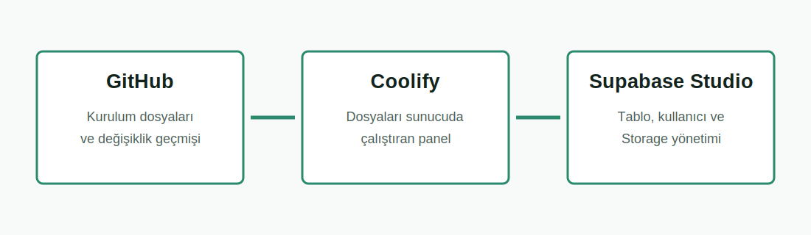
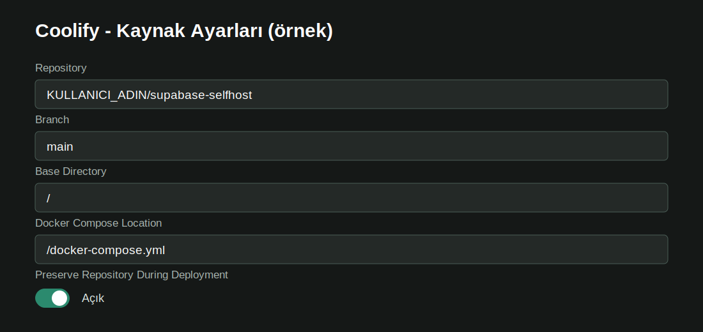
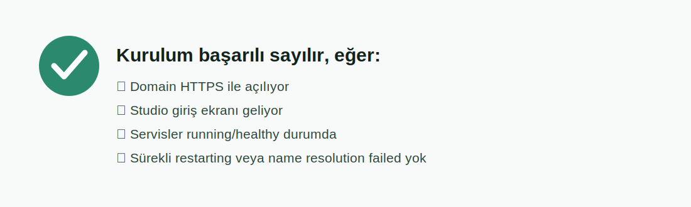

# Türkçe Resimli Supabase Kurulum Rehberi

Bu rehber, Docker veya Supabase bilmeyen birinin kurulumu karıştırmadan tamamlaması için hazırlanmıştır. Önce tamamını bir kez oku; sonra kutuları sırayla uygula.

> [!NOTE]
> Bu kurulum kendi sunucunda çalışan self-hosted Supabase içindir. Supabase Cloud hesabında proje oluşturmaz.

## 1. Başlamadan Önce

Şunların hazır olması gerekir:

- En az 2 CPU, 4 GB RAM ve 40 GB SSD; önerilen 4 CPU, 8 GB RAM ve 80 GB SSD.
- Ubuntu/Debian gibi bir Linux sunucu.
- Sunucuya yönlendirilmiş bir alt domain. Örnek: `supabase.ornek.com`.
- GitHub hesabı.
- Coolify kuruluysa çalışan bir Coolify sunucusu.

**Domain kontrolü:** DNS panelinde `A` kaydı aç. Ad/Host kısmına `supabase`, değer kısmına sunucunun IPv4 adresini yaz. DNS'in yayılması birkaç dakika veya daha uzun sürebilir.

## 2. Üç Şeyi Birbirine Karıştırma

| Kavram | Ne demek? |
|---|---|
| GitHub reposu | Kurulum dosyalarının saklandığı yer |
| Coolify | Dosyaları sunucuda Docker olarak çalıştıran panel |
| Supabase Studio | Kurulum bitince tablo, kullanıcı ve Storage yönettiğin panel |



## Yol A: Coolify ile Kurulum

### A1. Repoyu Kendi Hesabına Al

Bu sayfanın üstündeki **Fork** düğmesine bas. Açılan ekranda:

- Owner: kendi GitHub hesabın
- Repository name: örneğin `supabase-selfhost`
- Copy the `main` branch only: açık

Sonra **Create fork** düğmesine bas.

> [!WARNING]
> Kendi gerçek `.env` dosyanı, şifreni veya anahtarlarını bu repoya yükleme.

### A2. Coolify'de Kaynak Oluştur

Coolify'de sırayla:

1. Bir Project aç.
2. Production environment içine gir.
3. **New Resource** seç.
4. **Docker Compose** ve GitHub repository seçeneğini seç.
5. Bir önceki adımda fork ettiğin repoyu seç.

Formu aşağıdaki gibi doldur:



| Alan | Yazılacak değer |
|---|---|
| Branch | `main` |
| Base Directory | `/` |
| Docker Compose Location | `/docker-compose.yml` |
| Preserve Repository During Deployment | Açık |

### A3. Domain Ekle

Coolify'deki **Domains** bölümünde sadece `kong` servisine şu biçimde domain ver:

```text
https://supabase.ornek.com
```

Sona `:8000` ekleme; Coolify HTTPS'i 443 üzerinden Kong'un iç portuna yönlendirir. Studio, Auth, REST, Realtime, Storage, Functions, Meta ve Supavisor için ayrı public domain oluşturma.

### A4. Ortam Değişkenlerini Hazırla

Bu repo güvenli anahtar üretmek için script içerir. En kolay güvenli yöntem, repoyu bir Linux terminalinde geçici olarak klonlayıp anahtarları üretmek ve oluşan `.env` değerlerini Coolify'nin Environment Variables alanına aktarmaktır:

```bash
git clone https://github.com/KULLANICI_ADIN/supabase-selfhost.git
cd supabase-selfhost
cp .env.example .env
sh utils/generate-keys.sh --update-env
sh utils/add-new-auth-keys.sh --update-env
```

İkinci script `.env` yanında `docker-compose.yml` içindeki modern JWKS ayarlarını da etkinleştirir. Coolify kendi forkunu deploy ediyorsa değişen `docker-compose.yml` dosyasını kontrol edip forkundaki ayrı bir dala commit/push et; aksi halde Coolify eski Compose dosyasını kullanır. `.env` dosyasını kesinlikle commit etme.

Sonra `.env` içindeki şu URL alanlarını kendi domainine göre değiştir:

```env
SUPABASE_PUBLIC_URL=https://supabase.ornek.com
API_EXTERNAL_URL=https://supabase.ornek.com/auth/v1
SITE_URL=https://uygulamam.ornek.com
STUDIO_DEFAULT_ORGANIZATION=Benim Organizasyonum
STUDIO_DEFAULT_PROJECT=Benim Supabase Projem
```

`.env` içeriğini Coolify Environment Variables alanına aktar. Gerçek değerleri GitHub'a commit etme.

**Studio giriş bilgisi:** `DASHBOARD_USERNAME` kullanıcı adıdır, `DASHBOARD_PASSWORD` paroladır. Parolada en az bir harf bulunmalıdır.

### A5. Deploy Et

Coolify'de sırayla **Save**, **Reload Compose File** ve **Deploy** düğmelerini kullan. İlk kurulumda imajların indirilmesi zaman alabilir.

Deployment bittikten sonra servis durumlarında `running` veya `healthy` görmelisin. Sürekli `restarting` olan servis varsa deploy başarılı sayılmaz.

### A6. Studio'ya Gir

Tarayıcıda şu adresi aç:

```text
https://supabase.ornek.com/project/default
```

Tarayıcının kullanıcı adı/parola kutusuna `DASHBOARD_USERNAME` ve `DASHBOARD_PASSWORD` değerlerini gir.



## Yol B: Düz Linux Sunucu ve Docker

Sunucuda terminal açıp çalıştır:

```bash
git clone https://github.com/akin-umit/supabase-turkiye-community.git supabase-selfhost
cd supabase-selfhost
cp .env.example .env
sh utils/generate-keys.sh --update-env
sh utils/add-new-auth-keys.sh --update-env
```

`.env` içindeki domain ve proje adı alanlarını Yol A'daki örneğe göre düzenle. Sonra:

```bash
docker compose --env-file .env config -q
docker compose pull
docker compose up -d
docker compose ps
```

Production'da Kong'u Caddy, Nginx veya Traefik ile HTTPS arkasına al. Reverse proxy tek başına host üzerindeki `8000`, `8443`, `15432` veya `6543` portlarını kapatmaz. Firewall ya da loopback bind ayarıyla doğrudan erişimi engelle; yalnız gerekli HTTPS girişini aç. PostgreSQL ve Supavisor portlarını güvenilmeyen ağlara açma.

## Uygulamaya Bağlanmak İçin Anahtarlar

Kurulumdan sonra uygulamanın ihtiyaç duyduğu temel değerler `.env` içindedir:

| Değer | Nerede kullanılır? |
|---|---|
| `SUPABASE_PUBLIC_URL` | Uygulamadaki Supabase URL |
| `SUPABASE_PUBLISHABLE_KEY` veya `ANON_KEY` | Tarayıcı/mobil istemci |
| `SUPABASE_SECRET_KEY` | Yalnız güvenli backend/sunucu |
| `POSTGRES_PASSWORD` | Veritabanı yönetimi |

> [!CAUTION]
> `SUPABASE_SECRET_KEY`, `SERVICE_ROLE_KEY` veya `POSTGRES_PASSWORD` değerini React/Vue/HTML gibi kullanıcıya giden frontend koduna koyma.

## Sık Hatalar

### Sayfada `name resolution failed` Yazıyor

Kong bir iç servisi Docker ağında bulamıyor demektir. Coolify'de repo korunumu, Compose yolu ve network alias'ları kontrol edilir. Ayrıntı: [COOLIFY.md](../COOLIFY.md#bilinen-coolify-tuzaklari).

### Servis Sürekli `restarting`

1. Coolify Logs ekranında ilk hata satırını bul.
2. `POSTGRES_HOST` ve `POSTGRES_HOSTNAME` değerlerinin `db` olduğunu kontrol et.
3. İç PostgreSQL portunun `5432` olduğunu kontrol et.
4. Eksik environment variable olup olmadığını kontrol et.
5. Bind mount dosyalarının klasöre dönüşmediğini kontrol et.

### Kullanıcı Adı ve Parola Kabul Edilmiyor

- `DASHBOARD_USERNAME` ve `DASHBOARD_PASSWORD` değerlerini kontrol et.
- Parolanın yalnız rakamlardan oluşmadığından emin ol.
- Değeri değiştirdiysen servisi yeniden oluştur/redeploy et.
- Çok sayıda hatalı denemeden sonra gizli pencere veya farklı tarayıcıyla tekrar dene.

### Domain Açılmıyor

- DNS `A` kaydının doğru sunucu IP'sine gittiğini kontrol et.
- Domainin yalnız Kong'a bağlı olduğunu kontrol et.
- Coolify proxy ve TLS sertifika durumunu kontrol et.
- Domain alanına `:8000` yazdıysan kaldır.

## Kurulum Bitti Kontrol Listesi

- [ ] Studio adresi HTTPS ile açılıyor.
- [ ] Kullanıcı adı ve parola ile Studio'ya giriliyor.
- [ ] Coolify/Docker servislerinde sürekli restarting yok.
- [ ] Table Editor içinde test tablosu oluşturulabiliyor.
- [ ] Auth Users sayfası açılıyor.
- [ ] Storage içinde test bucket oluşturulabiliyor.
- [ ] `.env` GitHub'da görünmüyor.
- [ ] Sunucu dışına otomatik veritabanı ve Storage yedeği planlandı.

## Resmî Kaynaklar

Bu Türkçe rehber uygulama kolaylığı sağlar; teknik kaynak olarak Supabase'in güncel belgeleri esas alınır:

- [Supabase - Docker ile self-hosting](https://supabase.com/docs/guides/self-hosting/docker)
- [Supabase - Self-hosting farkları ve sorumlulukları](https://supabase.com/docs/guides/self-hosting)
- [Supabase - HTTPS ve reverse proxy](https://supabase.com/docs/guides/self-hosting/self-hosted-proxy-https)
- [Supabase - Yeni API anahtarları](https://supabase.com/docs/guides/self-hosting/self-hosted-auth-keys)

Bir adım bu rehberden farklı görünüyorsa [Issue aç](https://github.com/akin-umit/supabase-turkiye-community/issues/new/choose) ve mümkünse gizli bilgileri kapatarak ekran görüntüsü ekle.
